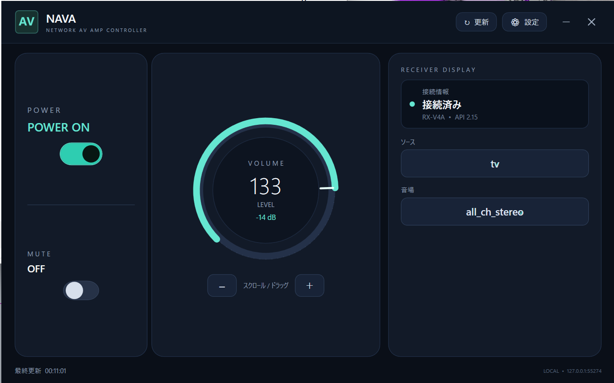
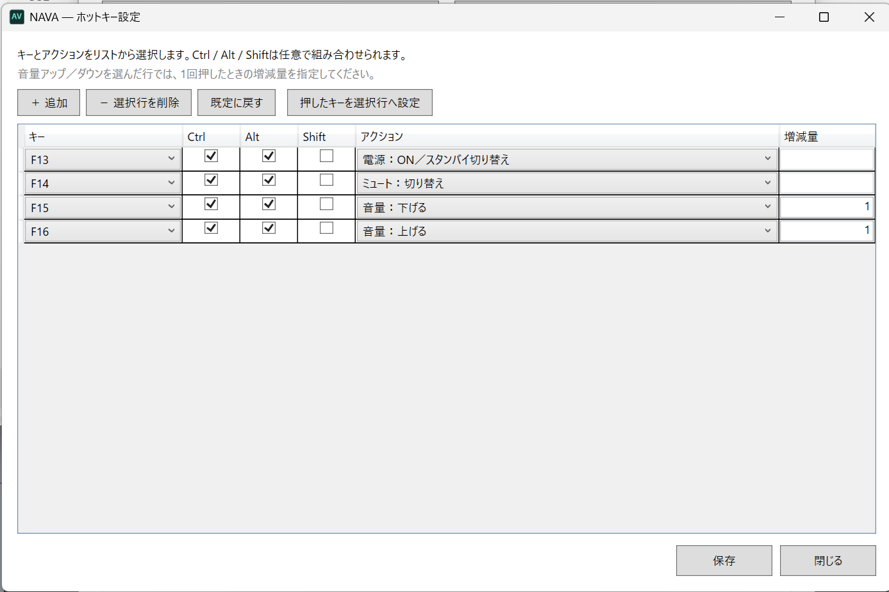
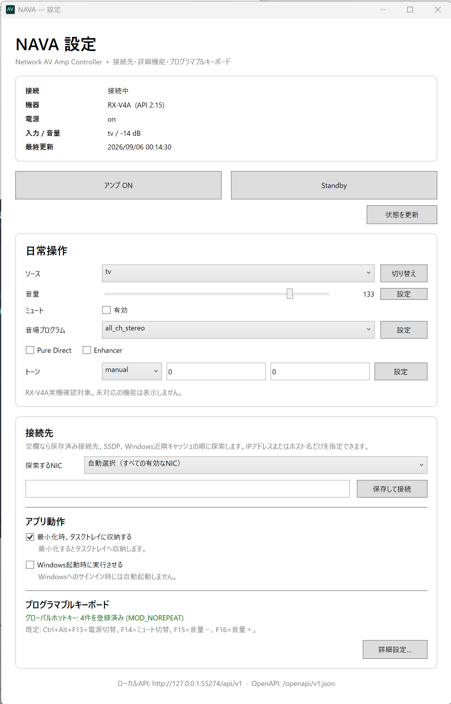

# NAVA 利用説明書

Network AV Amp Controller

版: 0.1

対象: Windows 11 x64 / Yamaha Extended Control対応アンプ

実機確認済み: Yamaha RX-V4A

## 1. このアプリについて

NAVAは、同一LAN上のYamahaアンプをPCから操作するタスクトレイ常駐アプリです。リモコン機能の完全再現ではなく、PC用アンプとしてよく使うMain Zone操作に重点を置いています。

- 電源ON／Standby
- 映像・音声入力の切り替え
- 音量とミュート
- 音場プログラム
- 3D Surround、Direct、Pure Direct、Enhancer
- トーン、EQ、左右バランス
- グローバルホットキー
- localhost REST API

表示される操作はアンプの`getFeatures`応答によって決まります。アンプが対応機能として公開しない項目は表示または実行されません。

本アプリはYamaha Extended Control API Specification (Basic / Advanced) Rev.2.00に基づく非公式プロジェクトです。ヤマハ株式会社による提供、承認、保証はありません。RX-V4A以外は公式APIとの互換動作であり、実機確認済みまたは動作保証対象ではありません。

## 2. 必要な環境

- Windows 11 x64
- PCとアンプが同じLANへ接続されていること
- ネットワーク制御に対応したYamahaアンプ
- 電源ONをネットワークから行う場合、アンプ側のネットワークスタンバイが有効であること

Windows 10、32bit Windows、macOS、Linuxは対象外です。通常利用でインターネット接続やクラウドサービスは必要ありません。

## 3. インストールと起動

### Portable版を使う場合

1. `NAVA-<バージョン>-win-x64-portable.zip`をダウンロードします。
2. ZIPを任意のフォルダーへ展開します。
3. 展開したファイルを同じフォルダーに保ったまま`NAVA.exe`を実行します。
4. 初回起動後、操作画面と通知領域にNAVAのアイコンが表示されます。

Portable版はインストール操作や管理者権限を必要としません。移動または削除するときは、先にタスクトレイメニューからNAVAを終了してください。

### インストーラー版を使う場合

1. `NAVA-<バージョン>-win-x64-setup.exe`を実行します。
2. 使用許諾を確認し、画面の案内に従ってインストールします。
3. スタートメニューの「NAVA」から起動します。

インストーラー版はユーザー領域へインストールされるため、通常は管理者権限を必要としません。必要に応じてセットアップ中にデスクトップショートカットを作成できます。

配布物はコード署名されていない場合があります。Windowsの警告が出た場合は、ダウンロード元とReleaseの内容を確認してください。出所を確認できない実行ファイルは起動しないでください。

### ダウンロード・実行時に安全性の警告が出る場合

1. ダウンロード元がNAVAの[正式なRelease](https://github.com/azuki2anko/NAVA/releases/tag/v0.1.0)であることを確認します。
2. PowerShellの`Get-FileHash <ファイル名> -Algorithm SHA256`でSHA-256を取得し、Releaseにある[`SHA256SUMS.txt`](https://github.com/azuki2anko/NAVA/releases/download/v0.1.0/SHA256SUMS.txt)と比較します。
3. 一致した場合だけ、Microsoft Edgeのダウンロード一覧で対象ファイルの「…」→「保持」→「詳細表示」→「保持」を選びます。
4. Portable版の`NAVA.exe`を開いたときにWindowsの確認画面が出た場合は、「詳細情報」でファイル名を確認し、配布元とSHA-256を確認済みの場合だけ「実行」を選びます。

NAVA 0.1.0はコード署名されていないため、「不明な発行元」と表示される場合があります。これはファイルが直ちに危険だという意味ではありませんが、安全性を保証する表示でもありません。配布元やSHA-256を確認できない場合は実行しないでください。マルウェアや脅威を検出したという警告の場合は続行せず、ファイルを削除してIssueで報告してください。SmartScreenやウイルス対策機能を無効にする必要はありません。

### ソースから起動する場合

```powershell
dotnet restore NetworkAVAmp.Controller.sln
dotnet run --project src/RxV4A.Desktop/RxV4A.Desktop.csproj -c Debug
```

## 4. 初回接続

起動直後は、次の順で読み取り専用の探索を行います。

1. 手動指定または前回保存した接続先
2. SSDP/UPnP探索
3. Windowsの近隣キャッシュ
4. 小さいサブネットのping探索

広いサブネットをping探索する必要がある場合は、対象ホスト数を表示して確認します。確認前に広範囲の探索は行いません。探索中に電源、入力、音量などの設定は変更しません。

自動検出できない場合は、メイン画面の「接続先」へアンプのIPアドレスまたはホスト名を入力し、「保存して接続」を選択してください。`http://`やパスは入力せず、ホスト部分だけを指定します。

## 5. 画面の開き方

起動時に、日常操作用のメイン画面を表示します。アプリは画面を閉じてもタスクトレイへ常駐します。

- トレイアイコンをダブルクリック: 操作画面を表示
- トレイアイコンを右クリック: 状態、ミニ電源操作、操作画面、設定画面、状態更新、電源、終了
- 操作画面を最小化: 「最小化時、タスクトレイに収納する」がオンなら通知領域へ収納。オフならタスクバーへ残す

終了するときは、トレイメニューの「終了」を選択してください。画面の閉じるボタンは常駐状態へ戻します。

## 6. メイン画面

接続状態、モデル名、電源、入力、音量、最終更新時刻を表示します。更新ボタンで即時再取得でき、通常は低頻度の自動更新も行います。



- 電源／ミュート: 左側のトグルスイッチで明示的にON／OFFを設定します。
- 音量: 中央の円形ダイヤルをドラッグ、マウスホイール、または±ボタンで操作します。最小値、最大値、刻み幅はアンプから取得します。
- ソース／音場: 右側の表示をクリックし、アンプが返した一覧から選択します。
- 詳細設定: 画面右上の設定ボタンから、3D Surround、Direct、Pure Direct、Enhancer、トーン、EQ、バランス、接続先、ホットキーを設定します。

Power-on blockerが有効なときはON要求を拒否します。blocker中にリモコンなどで電源がONになっても、本アプリは自動でStandbyへ戻しません。対応していない機能は表示または操作できません。

操作した瞬間に画面表示を切り替え、その後バックグラウンドでMain Zone状態を読み戻して実機状態へ合わせます。通信に失敗した場合や確認がタイムアウトした場合は実機から取得できた状態へ戻します。物理リモコンやMusicCastアプリから変更した場合も、次回更新で同じ状態へ収束します。

## 7. ミニ電源操作

ミニ画面は最前面に表示されます。

- 設定画面の「起動時にミニ電源操作を表示する」をオンにすると、NAVA起動時に自動表示
- 左側のグリップをドラッグして移動
- 外周をドラッグしてサイズ変更
- 電源スイッチをクリックしてON／Standby
- 位置とサイズは自動保存
- 上下・左右に並べたマルチディスプレイ間を移動可能
- タスクバーと重なる位置へ置いた場合は、現在のモニターの作業領域内へ自動補正

ミニ画面はほかのアプリからフォーカスを奪いません。余白と状態表示部分は背後へクリックを通し、電源スイッチ、移動グリップ、サイズ変更用の外周だけがクリックを受け取ります。タスクバーの位置や向きが変わった場合も、ミニ画面を作業領域内へ戻してタスクバーの操作を妨げないようにします。

ディスプレイの仮想座標や解像度が変わった場合は、画面外へ残らないよう既定位置へ戻ります。

## 8. グローバルホットキー

既定値は次のとおりです。

| キー | 操作 |
|---|---|
| Ctrl+Alt+F13 | 電源切替 |
| Ctrl+Alt+F14 | ミュート切替 |
| Ctrl+Alt+F15 | 音量を1下げる |
| Ctrl+Alt+F16 | 音量を1上げる |



設定画面の「詳細設定…」から割り当て行を追加・削除できます。アクション、キー、Ctrl／Alt／Shift修飾キーを一覧から選択でき、音量操作では1回あたりの増減量も指定できます。キーはF1～F24、英数字、テンキー、移動・編集キー、メディアキーから選べます。ほかのアプリと競合したキーだけが登録失敗になり、アプリ全体は継続します。

## 9. localhost API

既定のURLは次のとおりです。

- API: `http://127.0.0.1:55274/api/v1`
- OpenAPI: `http://127.0.0.1:55274/openapi/v1.json`

APIは状態確認と型付き操作だけを提供し、任意のYamaha APIを転送する機能はありません。詳しい要求例は[`API_GUIDE.md`](API_GUIDE.md)を参照してください。

## 10. 設定とログ

設定画面では、機器の詳細操作、接続先、アプリ動作、グローバルホットキーをまとめて設定します。



「アプリ動作」には次の設定があります。

- 最小化時、タスクトレイに収納する: オンなら最小化時に通知領域へ収納し、オフならタスクバーに残します。
- 起動時にミニ電源操作を表示する: オンならNAVA起動時に最前面のミニ電源ボタンを表示します。
- Windows起動時に実行させる: Windowsへのサインイン時にNAVAを自動起動します。ユーザー別に登録され、管理者権限は不要です。

設定とログはリポジトリや実行ファイルのフォルダーではなく、次のユーザー領域へ保存されます。

- 設定: `%LocalAppData%\NAVA\settings.json`
- ログ: `%LocalAppData%\NAVA\logs`

設定には接続先や内部照合用の機器情報が含まれる可能性があります。設定ファイルや無加工ログをIssueへ添付しないでください。共有が必要な場合は、IPアドレス、MACアドレス、機器ID、トークン、個人パスを除去してください。

## 11. トラブルシューティング

### アンプが見つからない

- PCとアンプが同じLANにいるか確認します。
- Wi-FiのAP isolation、ゲストネットワーク、VPNを確認します。
- Windowsで使用するNICをメイン画面から選びます。
- アンプのIPアドレスまたはホスト名を手動指定します。
- SSDPが届かなくてもアンプ不在とは限りません。

### StandbyからONにできない

- アンプ側のネットワークスタンバイ設定を確認します。
- 画面にPower-on blockerの警告がないか確認します。
- `getFeatures`にMain Zoneの`power`がない機種では操作できません。

### 操作項目が表示されない

接続した機器が`getFeatures`で対応機能として公開していない項目は表示しません。RX-V4Aでも3D Surround、Direct、EQ、バランスなどがCapabilityに含まれない構成では表示されません。

### ホットキーが効かない

詳細設定の登録状態を確認してください。競合表示がある場合は、ほかのアプリと重ならない組み合わせへ変更します。

### 設定が壊れた

アプリをトレイメニューから終了し、`settings.json`を別名へ移動してから再起動すると初期設定を作成します。元ファイルは問題の確認が終わるまで保管してください。

## 12. 現在の制限

- 実機確認済みはRX-V4Aだけです。
- Tuner／ラジオ機能は保留中です。
- localhost以外へのAPI公開は未実装です。
- Portable版とインストーラー版はコード署名されていません。

## 13. アンインストール

Portable版は、トレイメニューからアプリを終了してから展開した配布フォルダーを削除します。

インストーラー版は、Windowsの「設定」→「アプリ」→「インストールされているアプリ」からNAVAをアンインストールします。自動起動の登録とインストール済みファイルが削除されます。

設定とログも不要な場合だけ、`%LocalAppData%\NAVA`を削除します。

ユーザー領域の削除を行うと、接続設定、ホットキー設定、ログは復元できません。
